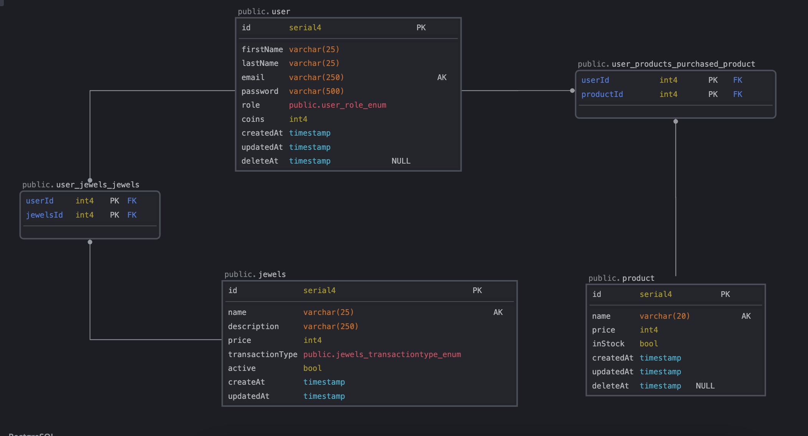

# Documentação do Culture Code

**Version**: 1.0

**Description**: Sistema de gamificação


## Project setup

```bash
$ npm install
```

## Compile and run the project

```bash
# development
$ npm run start

# watch mode
$ npm run start:dev

# production mode
$ npm run start:prod
```

## Run tests

```bash
# unit tests
$ npm run test

# e2e tests
$ npm run test:e2e

# test coverage
$ npm run test:cov
```

# DER


## Endpoints

### `/users/perfil`
#### GET
- **OperationId**: UsersController_profile
- **Responses**:
  - **200**: 
    - `application/json`: No example
  - **403**: 
    - `application/json`: {'message': 'token não encontrado'}

### `/users`
#### GET
- **OperationId**: UsersController_findAll
- **Responses**:
  - **200**: 
    - `application/json`: No example
  - **403**: 
    - `application/json`: {'message': 'token não encontrado'}

### `/users/{id}`
#### GET
- **OperationId**: UsersController_userById
- **Parameters**:
  - `id` (path): No description
- **Responses**:
  - **200**: 
    - `application/json`: No example
  - **403**: 
    - `application/json`: {'message': 'token não encontrado'}
#### PATCH
- **OperationId**: UsersController_update
- **Parameters**:
  - `id` (path): No description
- **Request Body**:
  - Content-Type: `application/json`
    - Schema: {'$ref': '#/components/schemas/UpdateUserDoc'}
- **Responses**:
  - **200**: 
    - `application/json`: No example
  - **401**: 
    - `application/json`: Você não tem permissão para atualizar outros usuários.
  - **403**: 
    - `application/json`: {'message': 'token não encontrado'}
#### DELETE
- **OperationId**: UsersController_delete
- **Parameters**:
  - `id` (path): No description
- **Responses**:
  - **200**: 
    - `application/json`: {'message': 'ok'}
  - **401**: 
    - `application/json`: Você não tem permissão para atualizar outros usuários.
  - **403**: 
    - `application/json`: {'message': 'token não encontrado'}

### `/auth/register`
#### POST
- **OperationId**: AuthController_register
- **Request Body**:
  - Content-Type: `application/json`
    - Schema: {'$ref': '#/components/schemas/UserRegisterDoc'}
- **Responses**:
  - **201**: 
    - `application/json`: No example
  - **400**: 
    - `application/json`: usuario existente.

### `/auth/login`
#### POST
- **OperationId**: AuthController_login
- **Request Body**:
  - Content-Type: `application/json`
    - Schema: {'$ref': '#/components/schemas/LoginDoc'}
- **Responses**:
  - **201**: 
    - `application/json`: No example
  - **401**: 
    - `application/json`: Cedencial Invalida

### `/auth/find`
#### GET
- **OperationId**: AuthController_findAllProducts
- **Parameters**:
  - `price` (query): No description
  - `name` (query): No description
  - `limit` (query): No description
  - `page` (query): No description
- **Responses**:
  - **200**: 
    - `application/json`: No example
  - **400**: 
    - `application/json`: página e limite obrigatórios

### `/products`
#### POST
- **OperationId**: ProductsController_create
- **Request Body**:
  - Content-Type: `application/json`
    - Schema: {'$ref': '#/components/schemas/CreateProductDoc'}
- **Responses**:
  - **200**: 
    - `application/json`: No example
  - **400**: 
    - `application/json`: Produto ja existe
  - **403**: 
    - `application/json`: {'message': 'Token não encontrado'}

### `/products/reward/{id}`
#### POST
- **OperationId**: ProductsController_reward
- **Parameters**:
  - `id` (path): No description
- **Responses**:
  - **201**: 
    - `application/json`: No example
  - **400**: 
    - `application/json`: Insufficient jewels
  - **403**: 
    - `application/json`: {'message': 'Token não encontrado'}
  - **404**: 
    - `application/json`: Este produto com o ID: 7 não foi encontrado ou está sem estoque

### `/products/{id}`
#### GET
- **OperationId**: ProductsController_productById
- **Parameters**:
  - `id` (path): No description
- **Responses**:
  - **200**: 
    - `application/json`: No example
  - **403**: 
    - `application/json`: {'message': 'Token não encontrado'}
  - **404**: 
    - `application/json`: Este produto com o ID: 8 não foi encontrado ou está sem estoque
#### PATCH
- **OperationId**: ProductsController_update
- **Parameters**:
  - `id` (path): No description
- **Request Body**:
  - Content-Type: `application/json`
    - Schema: {'$ref': '#/components/schemas/UpdateProductDoc'}
- **Responses**:
  - **200**: 
    - `application/json`: No example
  - **403**: 
    - `application/json`: {'message': 'Token não encontrado'}
  - **404**: 
    - `application/json`: Este produto com o ID: 9 não foi encontrado ou está sem estoque
#### DELETE
- **OperationId**: ProductsController_delete
- **Parameters**:
  - `id` (path): No description
- **Responses**:
  - **200**: 
    - `application/json`: {'message': 'Produto deletado'}
  - **403**: 
    - `application/json`: {'message': 'Token não encontrado'}
  - **404**: 
    - `application/json`: Este produto com o ID: 3 não foi encontrado ou está sem estoque

### `/jewels/assign/{jewelId}/{userId}`
#### POST
- **OperationId**: JewelsController_distribuiteJewels
- **Parameters**:
  - `jewelId` (path): No description
  - `userId` (path): No description
- **Responses**:
  - **201**: 
    - `application/json`: No example
  - **403**: 
    - `application/json`: {'message': 'token não encontrado'}
  - **404**: 
    - `application/json`: Usuário ou joia não encontrada, ou a joia está inativa

### `/jewels`
#### POST
- **OperationId**: JewelsController_create
- **Request Body**:
  - Content-Type: `application/json`
    - Schema: {'$ref': '#/components/schemas/CreateJewelsDoc'}
- **Responses**:
  - **201**: 
    - `application/json`: No example
  - **400**: 
    - `application/json`: Esta joia já existe.
  - **403**: 
    - `application/json`: {'message': 'Token não encontrado'}
#### GET
- **OperationId**: JewelsController_findAll
- **Responses**:
  - **200**: 
    - `application/json`: No example
  - **403**: 
    - `application/json`: {'message': 'Token não encontrado'}

### `/jewels/{id}`
#### GET
- **OperationId**: JewelsController_jewelById
- **Parameters**:
  - `id` (path): No description
- **Responses**:
  - **201**: 
    - `application/json`: No example
  - **403**: 
    - `application/json`: {'message': 'Token não encontrado'}
  - **404**: 
    - `application/json`: Este produto com o ID: 9 não foi encontrado!
#### PATCH
- **OperationId**: JewelsController_update
- **Parameters**:
  - `id` (path): No description
- **Request Body**:
  - Content-Type: `application/json`
    - Schema: {'$ref': '#/components/schemas/UpdateJewelsDoc'}
- **Responses**:
  - **200**: 
    - `application/json`: No example
  - **403**: 
    - `application/json`: {'message': 'Token não encontrado'}
  - **404**: 
    - `application/json`: Este produto com o ID: 9 não foi encontrado!
